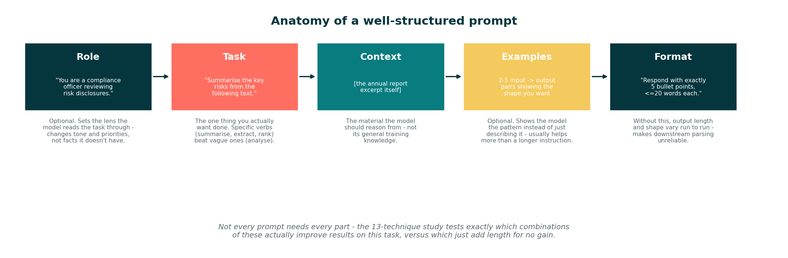
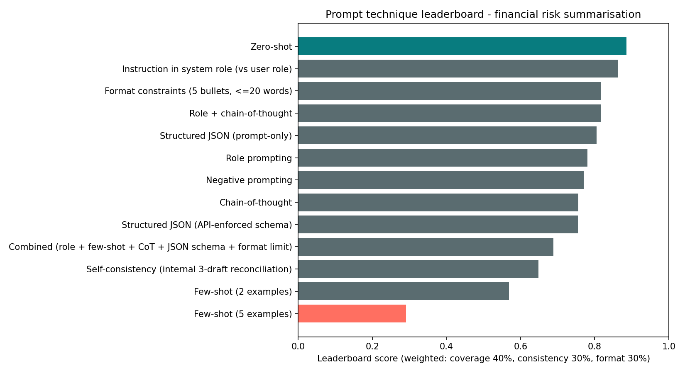
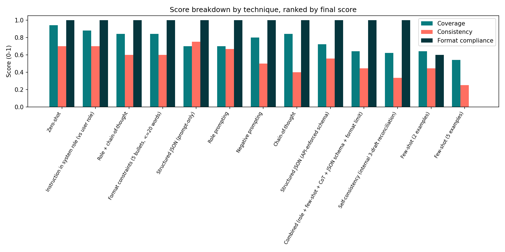

<!--
LinkedIn write-up. LinkedIn doesn't render Markdown, so when posting: copy the
text below into the post composer (skip the image markdown lines) and attach
outputs/prompt_anatomy_diagram.png, outputs/leaderboard.png, and
outputs/score_breakdown.png as native image uploads at the matching points.
-->

# I ran 65 prompts to find the best way to get an LLM to summarise financial risk disclosures - the plainest prompt won

Every bank, consultancy, and fintech is trying to get LLMs to reliably process
financial documents right now. The advice out there is mostly vibes: "try
chain-of-thought," "add a few examples," "tell it to be a compliance officer."
So I actually tested it - 13 different prompt engineering techniques, run 5
times each (65 calls total), on the same real task: summarising the key risks
from a section of JPMorgan Chase's FY2025 10-K filing.

## What is prompt engineering, actually?

It's the practice of designing the *input* to an LLM so the *output* is
reliable - not just correct once, but correct and consistently shaped every
time you run it. The same model, given the same underlying task, can produce
wildly different quality depending on how the request is worded, what context
it's given, and what output shape it's told to follow. That gap is the entire
subject of this study.

A well-structured prompt is usually built from a few distinct parts, and not
every prompt needs all of them:



**A weak prompt** for this task looks like:

> "Tell me about the risks in this text: [excerpt]"

Vague verb ("tell me about"), no output shape, no sense of audience or
priority. The model has to guess what "about" means, how long an answer should
be, and in what format - so it guesses differently every time you ask.

**A stronger prompt** for the same task looks like:

> "You are a compliance officer at a bank, reviewing risk disclosures for a
> client briefing. Summarise the key risks from the following section of an
> annual report. Respond with exactly 5 bullet points, each 20 words or fewer.
> No preamble, no closing remarks - only the 5 bullets.
>
> [excerpt]"

Same underlying task, same source text - but now there's a role (sets the
lens), a specific verb (summarise, not "tell me about"), and an explicit
output shape. Whether that specific combination actually performs best, or
whether it's over-engineered compared to something simpler, is exactly what
the leaderboard below settles - with real numbers, not guesswork.

## The setup

- **Task**: summarise the key risks from a ~220-word excerpt of JPMorgan's
  "successful cyber attack" risk disclosure (Item 1A, Form 10-K, filed with the
  SEC)
- **Model**: Gemini 3.5 Flash-Lite (Google's free API tier - no cost to run this)
- **Ground truth**: I read the excerpt once and built a checklist of the 10
  distinct risk themes it actually contains, then scored every output against
  that checklist rather than using another LLM as judge
- **What I measured**: coverage (did it find the right risks), consistency
  (does it find the *same* risks every time you ask), and format compliance
  (did it actually follow the requested output format)



## What won, and what didn't

**Zero-shot won.** No role, no examples, no reasoning steps, no format
instructions - just the plain instruction and the text. It scored 0.886
overall, and it won specifically on coverage (0.94, the *highest* of all 13
techniques) - it wasn't winning by default because everything else failed,
it was actually finding more of the real risks than the "smarter" techniques.

Right behind it, in 2nd place, was the same exact instruction moved from the
user role into the system role (0.862) - which tells you the ranking isn't
noise: two techniques that are almost the same prompt land next to each other.

**Few-shot examples actively hurt - badly.** Both few-shot variants finished
last. 5 examples scored 0.291, the worst of all 13, with 0% format compliance
- every single run merged all the risks into one giant bullet instead of a
list. I dug into why rather than just reporting the number: 2 of my 5
hand-written examples happened to show a single combined bullet as the
"correct" output shape. The model picked up on that inconsistency and matched
it, exactly the way you'd expect if you actually understand how few-shot
prompting works - it treated my own inconsistent examples as the pattern to
copy. That's a real lesson about curating few-shot examples, not just adding
more of them.

**Chain-of-thought didn't help, and cost more.** On its own, CoT actually
finished near the bottom on consistency (0.40, one of the lowest of all 13)
while taking almost 2x as long per call (2.23s vs zero-shot's 1.34s). Asking
the model to reason step-by-step before answering made it *less* likely to
reach the same conclusion twice, not more.

**Stacking techniques together didn't compound the gains.** The "kitchen
sink" variant - role + few-shot + chain-of-thought + JSON schema + format
limit, all five techniques combined - ranked 10th out of 13 (0.689),
dragged down by the same few-shot problem plus added complexity. More
technique is not automatically a better prompt.



## The winning prompt template

```
Summarise the key risks from the following section of an annual report.

[insert your text here]
```

That's the entire prompt. No system instruction, no persona, no examples, no
format constraints - and it beat every technique that added any of those.
Exact definition: `src/prompts.py`, technique id `zero_shot`.

## What actually mattered

- **Simplicity beat sophistication on this specific task.** That's not a
  universal law of prompting - it's a finding about *this* task (a single,
  well-defined summarisation job against a short, clean excerpt). More
  complex tasks with ambiguous instructions or multi-step reasoning would
  likely favour different techniques. The point isn't "zero-shot always
  wins" - it's "test before you assume a fancier prompt is better."
- **Consistency and coverage are genuinely different failure modes.**
  Structured JSON (prompt-only) had the *best* consistency of any technique
  (0.75) but middling coverage (0.70) - it reliably found the same,
  incomplete set of risks every time. Chain-of-thought had good coverage
  (0.84) but poor consistency (0.40) - it found different risks each run.
  A leaderboard that only tracked one of these would have missed half the
  story.
- **Format compliance is a real, separate risk, not a given.** Every
  free-text technique hit 100% format compliance (they didn't have a
  format to fail), but the two few-shot techniques - the only ones with
  inconsistent examples - dropped to 60% and 0%. If you're piping LLM
  output into anything downstream, that's the number to watch, not just
  "did it sound right."
- **The gap between best and worst is huge**: 0.886 vs 0.291, roughly 3x.
  For the exact same task, the exact same model, and the exact same
  source text, prompt wording alone was the difference between a
  production-usable output and a broken one.

## Why this, and not RAG

The three risk-related metrics I tracked - accuracy, consistency, and format
compliance - are exactly what you'd want to know before trusting an LLM in a
financial workflow, whether that's flagging risks in a filing, drafting a
client summary, or feeding structured output into a downstream system. Getting
this right with prompting alone, before reaching for a heavier architecture
like RAG, is the first thing worth getting right.

Full study, all 13 prompt definitions, and the raw results:
[github.com/sarayurkotha/prompt-engineering-study-finance](https://github.com/sarayurkotha/prompt-engineering-study-finance)

*Source: JPMorgan Chase & Co., Form 10-K, Item 1A Risk Factors, filed with the
U.S. Securities and Exchange Commission.*
