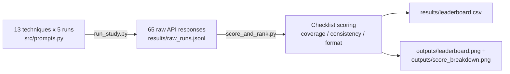

# Prompt Engineering Study for Finance

Tests 13 prompt engineering techniques on the same task - summarising the key
risks from a real bank's SEC filing - to find out which technique actually
produces the most accurate, complete, consistent, and well-formatted output.
Runs each technique 5 times (65 calls total) against Google's free-tier Gemini
API, scores every output against a manually-built ground-truth checklist, and
ranks the results into a leaderboard.

## Task and data source

- **Task**: "Summarise the key risks from the following section of an annual report."
- **Source excerpt**: `data/source_excerpt.txt` - the "successful cyber attack" risk
  subsection from JPMorgan Chase & Co.'s FY2025 Form 10-K, Item 1A Risk Factors
  (filed with the SEC, publicly available). ~220 words, kept short and
  self-contained on purpose so every technique is tested against the identical
  input - this project holds the input constant and varies only the prompt.
- **Ground truth**: `data/ground_truth_checklist.json` - 10 risk themes actually
  present in that excerpt, built once by reading the source text, each with a
  set of keyword variants used for scoring. This is deliberately NOT another LLM
  acting as judge - a fixed, human-built checklist is more reproducible and
  avoids the circularity of using an LLM to grade an LLM.
- **Model**: `gemini-3.5-flash-lite` via the free tier of Google AI Studio (no
  credit card required). The variable under test is the *prompt*, not the
  model, so a single model is used throughout to keep that isolated - the
  full `flash` tier's free quota is only 5 requests/minute, too tight for a
  65-call study; `flash-lite` has its own, much roomier free quota.

## Why not RAG?

The companion project [rag-banking-regulation-qa](https://github.com/sarayurkotha/rag-banking-regulation-qa)
is a retrieval system over a larger document corpus. This project is the
opposite case on purpose: the input is one short, fixed excerpt, so there's
nothing to retrieve - the full excerpt is inserted directly into the prompt
every time. Using RAG here would just be unnecessary complexity for a task
that doesn't need it.

## The 13 techniques

| # | Technique | Category |
|---|-----------|----------|
| 1 | Zero-shot | baseline |
| 2 | Few-shot (2 examples) | few-shot |
| 3 | Few-shot (5 examples) | few-shot |
| 4 | Chain-of-thought | reasoning |
| 5 | Role prompting ("you are a compliance officer") | persona |
| 6 | Role + chain-of-thought | combined |
| 7 | Structured JSON (prompt-only) | structured |
| 8 | Structured JSON (API-enforced schema) | structured |
| 9 | Negative prompting | constraint |
| 10 | Format constraints (exactly 5 bullets, <=20 words each) | constraint |
| 11 | Self-consistency (3 internal drafts, reconciled) | reasoning |
| 12 | Instruction in system role vs user role | structural |
| 13 | Combined "kitchen sink" (role + few-shot + CoT + JSON schema + format limit) | combined |

Full definitions, including the exact prompt text for each: `src/prompts.py`.

## Scoring methodology

Each of the 5 runs per technique is scored on three 0-1 metrics, combined into
a weighted leaderboard score:

- **Coverage (40%)** - fraction of the 10 ground-truth risk themes the output
  actually mentions (checklist keyword match, not an LLM judge)
- **Consistency (30%)** - (themes found in ALL 5 runs) / (themes found in AT
  LEAST 1 run). A technique that finds the same risks every time scores near
  1.0; one that finds different risks each run scores near 0
- **Format compliance (30%)** - fraction of the 5 runs that actually followed
  the requested output format (valid JSON, exactly 5 bullets, etc. - checked
  per-technique in `src/prompts.py`, not just "did it look okay")

Weights are constants in `src/score_and_rank.py` - change them and re-run to
see how the ranking shifts.

## Pipeline



## Results

| Rank | Technique | Coverage | Consistency | Format | Score |
|------|-----------|----------|-------------|--------|-------|
| 1 | Zero-shot | 0.94 | 0.70 | 1.00 | **0.886** |
| 2 | Instruction in system role (vs user role) | 0.88 | 0.70 | 1.00 | 0.862 |
| 3 | Role + chain-of-thought | 0.84 | 0.60 | 1.00 | 0.816 |
| 4 | Format constraints (5 bullets, <=20 words) | 0.84 | 0.60 | 1.00 | 0.816 |
| 5 | Structured JSON (prompt-only) | 0.70 | 0.75 | 1.00 | 0.805 |
| 6 | Role prompting | 0.70 | 0.67 | 1.00 | 0.780 |
| 7 | Negative prompting | 0.80 | 0.50 | 1.00 | 0.770 |
| 8 | Chain-of-thought | 0.84 | 0.40 | 1.00 | 0.756 |
| 9 | Structured JSON (API-enforced schema) | 0.72 | 0.56 | 1.00 | 0.755 |
| 10 | Combined "kitchen sink" | 0.64 | 0.44 | 1.00 | 0.689 |
| 11 | Self-consistency (3-draft reconciliation) | 0.62 | 0.33 | 1.00 | 0.648 |
| 12 | Few-shot (2 examples) | 0.64 | 0.44 | 0.60 | 0.569 |
| 13 | Few-shot (5 examples) | 0.54 | 0.25 | 0.00 | 0.291 |

Full table: `results/leaderboard.csv`. Raw per-run detail: `results/scored_runs.csv`.

**The winner is the plainest prompt in the set.** Zero-shot beat every technique
that added a role, examples, reasoning steps, or structured output - and it
did so on coverage specifically (0.94, the highest of all 13), not just by
avoiding some other technique's weakness. See `ARTICLE.md` for the full
breakdown of what that means and which techniques actively hurt.

## Winning prompt template

```
Summarise the key risks from the following section of an annual report.

[insert your text here]
```

That's it - no role, no examples, no format instructions. Exact definition:
`src/prompts.py`, technique id `zero_shot`.

## Reproducing this study

```bash
pip install google-genai python-dotenv pandas matplotlib
# 1. Get a free API key at https://aistudio.google.com (no credit card)
# 2. Create a .env file in the project root: GEMINI_API_KEY=your-key-here
cd src
python run_study.py               # -> results/raw_runs.jsonl (65 API calls, ~4 min)
python score_and_rank.py          # -> results/leaderboard.csv + outputs/*.png
python build_explainer_diagram.py # -> outputs/prompt_anatomy_diagram.png (no API calls)
```

`run_study.py` is safe to re-run if it's interrupted or hits a rate limit -
any (technique, run) pair that already succeeded is skipped, not redone.

## Repository structure

```
README.md
ARTICLE.md
.env                             (gitignored - you create this yourself)
data/
  source_excerpt.txt
  ground_truth_checklist.json
src/
  prompts.py
  run_study.py
  score_and_rank.py
  build_explainer_diagram.py
results/
  raw_runs.jsonl
  scored_runs.csv
  leaderboard.csv
outputs/
  leaderboard.png
  score_breakdown.png
  prompt_anatomy_diagram.png
notebooks/
  prompt_study.ipynb
```
